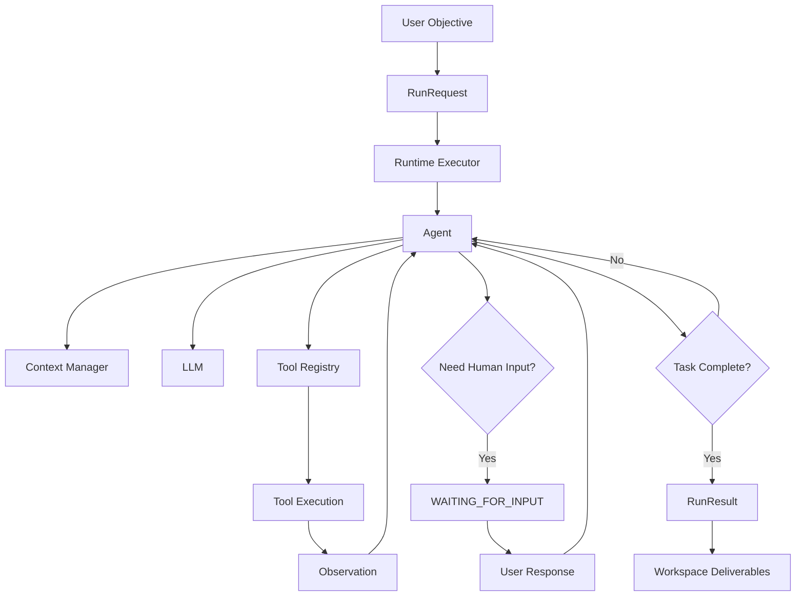
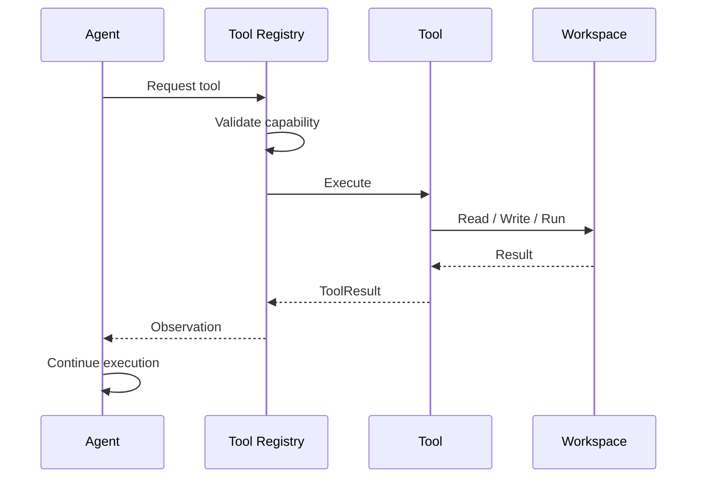
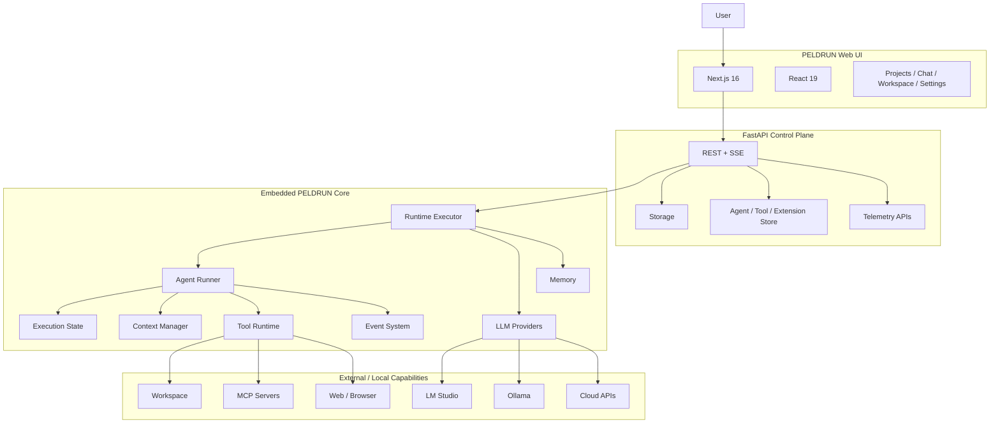
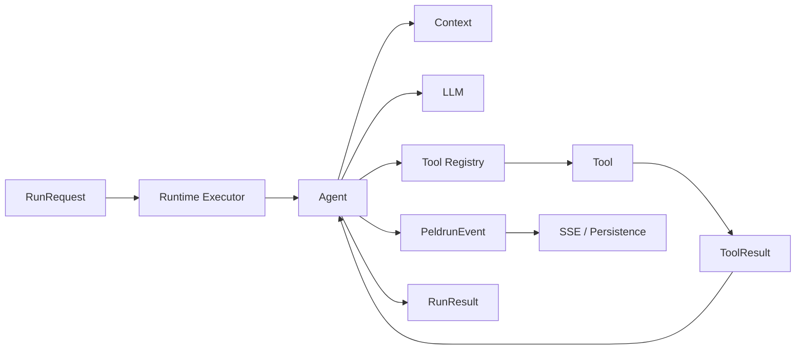
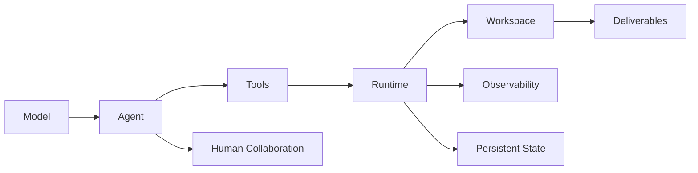

<p align="center">
  <picture>
    <source media="(prefers-color-scheme: dark)" srcset="assets/image/peldrun-logo-light.svg">
    <source media="(prefers-color-scheme: light)" srcset=" assets/image/peldrun-logo-dark.svg">
    
  </picture>
</p>
<div align="center">

# PELDRUN

<br>

## 👋 — Professional AI Agent

### An AI that can work on the task — not just talk about it.

**Search. Plan. Use tools. Write files. Run code. Ask when it needs you. Resume. Inspect the result.**

**PELDRUN is built around AI execution — not AI conversation alone.**

<br>

[](https://github.com/peldrun/peldrun)
[](https://nextjs.org/)
[](https://react.dev/)
[](https://fastapi.tiangolo.com/)
[](https://www.python.org/)
[](LICENSE)

<br>

**[Get Started](#quick-start) · [Why PELDRUN?](#why-peldrun) · [What Can It Do?](#what-can-peldrun-do) · [Architecture](#architecture) · [For Developers](#for-developers)**

</div>

---

<a id="table-of-contents"></a>

<a id="top"></a>

# Table of Contents

### For Everyone

* [Why PELDRUN?](#why-peldrun)
* [The 30-Second Test](#the-30-second-test)
* [What Can PELDRUN Do?](#what-can-peldrun-do)
* [Who Is PELDRUN For?](#who-is-peldrun-for)
* [PELDRUN vs. Traditional AI Chat](#peldrun-vs-traditional-ai-chat)
* [Quick Start](#quick-start)
* [Your First Real Task](#your-first-real-task)

### Product & Capabilities

* [How PELDRUN Works](#how-peldrun-works)
* [Agents](#agents)
* [Tools](#tools)
* [Human-in-the-Loop](#human-in-the-loop)
* [Projects & Workspaces](#projects--workspaces)
* [Files & Deliverables](#files--deliverables)
* [Models & Providers](#models--providers)
* [MCP & Extensions](#mcp--extensions)
* [Local-First Design](#local-first-design)

### Engineering

* [Architecture](#architecture)
* [Embedded PELDRUN Core](#embedded-peldrun-core)
* [Execution Model](#execution-model)
* [Runtime State](#runtime-state)
* [Context Management](#context-management)
* [Checkpoints & Durability](#checkpoints--durability)
* [Tool Execution Policies](#tool-execution-policies)
* [Storage Model](#storage-model)
* [Telemetry & Observability](#telemetry--observability)
* [Security Model](#security-model)
* [Repository Structure](#repository-structure)
* [Technology Stack](#technology-stack)

### Developers

* [Developer Quick Start](#developer-quick-start)
* [Extending PELDRUN](#extending-peldrun)
* [Custom Agents](#custom-agents)
* [Custom Tools](#custom-tools)
* [Contributing](#contributing)
* [Project Direction](#project-direction)

### Reference

* [What PELDRUN Is Not](#what-peldrun-is-not)
* [Long-Term Vision](#long-term-vision)
* [License](#license)
* [Links](#links)

---

<a id="why-peldrun"></a>

# Why PELDRUN?

Most AI applications are built around a simple interaction:

> **You ask → AI answers.**

PELDRUN starts from a different question:

> **What if the AI had to actually do the work?**

That means the useful unit is no longer only the response.

It is the **task**.

A task can involve research, several tool calls, file creation, code execution, user decisions, retries, inspection, and a final deliverable.

### The core idea

```text
                     TRADITIONAL AI CHAT

                         User
                           │
                           ▼
                         Prompt
                           │
                           ▼
                         Model
                           │
                           ▼
                         Answer


                     PELDRUN EXECUTION

                         User
                           │
                           ▼
                        Objective
                           │
                           ▼
                  ┌───────────────────┐
                  │   Agent Runtime   │
                  └─────────┬─────────┘
                            │
          ┌─────────────────┼─────────────────┐
          ▼                 ▼                 ▼
       Reason             Tools            Context
          │                 │                 │
          └─────────────────┼─────────────────┘
                            ▼
                        Observe
                            │
                            ▼
                  Continue / Ask / Retry
                            │
                            ▼
                     Create / Modify
                            │
                            ▼
                       Deliverable
```

PELDRUN is not simply trying to make AI conversation better.

It is trying to make AI **execution** more useful.

[↑ Back to top](#top)

---

<a id="the-30-second-test"></a>

# The 30-Second Test

You should not need to read an entire README to understand why PELDRUN might be worth trying.

Start it.

Then give it a real objective.

For example:

> **Research the current options for running local AI models on Windows, compare the strongest choices, recommend one, and save the result as a Markdown report.**

The intended workflow is:

```text
Understand
   ↓
Research
   ↓
Use tools
   ↓
Inspect results
   ↓
Compare
   ↓
Create report
   ↓
Save file
   ↓
Show result
```

Or try something more technical:

> **Inspect this project, identify the most important issue, fix it, run a test, and explain what changed.**

The important question is not:

**"Can the model write a good answer?"**

The better question is:

**"Can the system carry the task forward?"**

That is the reason to try PELDRUN.

[↑ Back to top](#top)

---

<a id="what-can-peldrun-do"></a>

# What Can PELDRUN Do?

| Capability              | What it means in practice                                                  |
| ----------------------- | -------------------------------------------------------------------------- |
| **Research**            | Search the live web, inspect sources, compare information, produce reports |
| **Coding**              | Read files, edit code, run commands, inspect failures, iterate             |
| **Data work**           | Execute Python, process datasets, calculate results, generate outputs      |
| **Web work**            | Navigate pages, inspect content, interact with web pages                   |
| **Document production** | Research → write → save → inspect → deliver                                |
| **Interactive tasks**   | Ask the user for clarification or confirmation and continue                |
| **Project work**        | Maintain persistent projects with multiple sessions                        |
| **File workflows**      | Create, inspect, edit, preview, and export deliverables                    |
| **Local AI**            | Use models through LM Studio or Ollama                                     |
| **Cloud AI**            | Connect to compatible hosted model endpoints                               |
| **MCP**                 | Extend capabilities through Model Context Protocol integrations            |
| **Custom automation**   | Add custom agents, tools, and extensions                                   |

### In one sentence

> **PELDRUN is designed for tasks where the answer is not enough.**

[↑ Back to top](#top)

---

<a id="who-is-peldrun-for"></a>

# Who Is PELDRUN For?

PELDRUN is intentionally designed for different types of users.

| User              | Why PELDRUN may be useful                                                     |
| ----------------- | ----------------------------------------------------------------------------- |
| **Everyday user** | Wants AI to complete useful tasks instead of only answering questions         |
| **Power user**    | Wants persistent projects, files, automation, and model flexibility           |
| **Developer**     | Wants an inspectable runtime with tools, state, events, and workspaces        |
| **AI engineer**   | Wants explicit agent execution semantics rather than a thin chat wrapper      |
| **Local AI user** | Wants to combine local models with real tools and persistent work             |
| **Researcher**    | Wants research workflows that can search, compare, organize, and save results |

The important point is that the same runtime serves both levels.

The UI should be approachable.

The architecture should be serious.

[↑ Back to top](#top)

---

<a id="peldrun-vs-traditional-ai-chat"></a>

# PELDRUN vs. Traditional AI Chat

This is not intended as a claim that traditional chat applications are bad.

They solve a different problem.

| Traditional AI Chat                 | PELDRUN                                         |
| ----------------------------------- | ----------------------------------------------- |
| Conversation is the primary unit    | Execution run is the primary unit               |
| Answer-centric                      | Task-centric                                    |
| Tool use is often secondary         | Tools are part of the runtime                   |
| Short interactions                  | Designed for multi-step tasks                   |
| User often coordinates the workflow | Agent can carry the workflow forward            |
| Files are often attachments         | Workspace is part of execution                  |
| Human input is conversation         | Human input can be a runtime state              |
| Errors are usually conversational   | Failures can be handled as execution events     |
| History is primarily chat history   | Conversation and execution history are distinct |
| Provider-centric                    | Provider-flexible                               |
| Usually cloud-first                 | Local-first architecture                        |

### The distinction

```text
Traditional:

    Prompt → Model → Answer


PELDRUN:

    Objective
       ↓
    Agent
       ↓
    Context
       ↓
    Tools
       ↓
    Observations
       ↓
    State
       ↓
    Human interaction when required
       ↓
    More execution
       ↓
    Deliverables
```

[↑ Back to top](#top)

---

<a id="quick-start"></a>

# Quick Start

> **Current status:** PELDRUN is a source-based development application. The current repository setup is intended for users who are comfortable installing Python/Node dependencies and running the local development services.

## Requirements

| Requirement                 | Current setup                  |
| --------------------------- | ------------------------------ |
| Operating system            | Windows                        |
| Python                      | 3.12+                          |
| Node.js                     | Required                       |
| npm                         | Required                       |
| Git                         | Required                       |
| Optional local inference    | LM Studio or Ollama            |
| Optional browser automation | Playwright browser environment |

### 1. Clone

```powershell
git clone https://github.com/peldrun/peldrun.git
cd peldrun
```

### 2. Backend

```powershell
cd backend

python -m venv .venv
.venv\Scripts\activate

pip install -r requirements.txt
```

### 3. Frontend

Open another terminal:

```powershell
cd frontend
npm install
```

### 4. Start PELDRUN

From the project root:

```powershell
.\start-all.ps1
```

Default endpoints:

| Service     | URL                          |
| ----------- | ---------------------------- |
| PELDRUN UI  | `http://localhost:3088`      |
| Backend API | `http://localhost:8088/api/` |
| API Docs    | `http://localhost:8088/docs` |

### 5. Configure a model

Use the Settings interface to configure a local or compatible model endpoint.

Typical local endpoints:

| Provider  | Endpoint                    |
| --------- | --------------------------- |
| LM Studio | `http://127.0.0.1:1234/v1`  |
| Ollama    | `http://127.0.0.1:11434/v1` |

[↑ Back to top](#top)

---

<a id="your-first-real-task"></a>

# Your First Real Task

Once PELDRUN is running, skip "Hello world".

Give it something that actually requires work.

### Research

> Research the best open-source vector databases for a small production application. Compare them, recommend one, and save the report as Markdown.

### Coding

> Inspect this project, find the most important bug you can identify, fix it, run a relevant test, and summarize the changes.

### Data

> Analyze the CSV files in the workspace, identify the major trends, and create a report with the important findings.

### Interactive

> Help me plan this project. Ask me the questions you need, then create a concrete implementation plan based on my answers.

The objective is to see the runtime working as a system.

[↑ Back to top](#top)

---

<a id="how-peldrun-works"></a>

# How PELDRUN Works

At a high level:



The important engineering concept is that **reasoning, tools, state, and persistence are all part of one execution system**.

[↑ Back to top](#top)

---

<a id="agents"></a>

# Agents

An agent is a configured identity and capability boundary for execution.

PELDRUN separates:

```text
Agent
   +
Tools
   +
Model
   +
Workspace
   +
Runtime
```

The application currently includes built-in agent manifests for different roles, including generalist, coding, research, and data-oriented use cases.

Agent definitions describe information such as:

* identity
* role
* system prompt
* tool access
* maximum steps
* enabled state

### Why this matters

The runtime should not silently give every agent every capability.

An agent should receive the capabilities it is explicitly assigned.

That makes the system easier to reason about, debug, and secure.

[↑ Back to top](#top)

---

<a id="tools"></a>

# Tools

PELDRUN tools are runtime capabilities.

The current built-in tool layer includes capabilities such as:

| Tool                 | Purpose                       |
| -------------------- | ----------------------------- |
| `web_search`         | Search live web information   |
| `browser_use`        | Navigate and inspect websites |
| `python_execute`     | Run Python code               |
| `bash`               | Execute terminal commands     |
| `str_replace_editor` | Inspect and modify files      |
| `file_saver`         | Manage generated deliverables |
| `ask_human`          | Pause for human input         |

The exact tools available to a run depend on the active agent and enabled capabilities.

### Tool execution flow



[↑ Back to top](#top)

---

<a id="human-in-the-loop"></a>

# Human-in-the-Loop

Autonomy is useful.

Blind autonomy is not.

PELDRUN therefore treats human interaction as an explicit runtime capability.

```text
Agent running
      ↓
Needs clarification / confirmation
      ↓
HumanInputRequest
      ↓
WAITING_FOR_INPUT
      ↓
User responds
      ↓
Request resolved
      ↓
Execution resumes
```

Supported interaction types include:

* free-text input
* confirmation
* selection
* multiple-choice style interactions

This matters for workflows where the AI can perform most of the work but a human should remain the authority for an important decision.

[↑ Back to top](#top)

---

<a id="projects--workspaces"></a>

# Projects & Workspaces

PELDRUN distinguishes between:

| Concept          | Purpose                                   |
| ---------------- | ----------------------------------------- |
| **Project**      | Long-lived area of work                   |
| **Session**      | A concrete task/run conversation          |
| **Workspace**    | Files and execution context for that work |
| **Events**       | Runtime execution history                 |
| **Deliverables** | Files produced by the task                |

A project can contain multiple sessions:

```text
Project
├── Project metadata
└── Chats
    ├── Session A
    │   ├── session.json
    │   ├── events.json
    │   └── files/
    ├── Session B
    │   ├── session.json
    │   ├── events.json
    │   └── files/
    └── ...
```

This is important for work that continues over time.

[↑ Back to top](#top)

---

<a id="files--deliverables"></a>

# Files & Deliverables

PELDRUN treats output as something that should survive the conversation.

The workspace interface includes:

| View          | Purpose                               |
| ------------- | ------------------------------------- |
| **Preview**   | Inspect previewable generated content |
| **Files**     | Browse workspace files                |
| **Editor**    | Modify source files                   |
| **Artifacts** | Inspect media deliverables            |
| **Logs**      | Review execution activity             |
| **Export**    | Export session files as ZIP           |

Current media artifact support includes:

* images
* videos
* PDFs

The underlying principle is:

> **The final response should not be the only thing the agent produces.**

[↑ Back to top](#top)

---

<a id="models--providers"></a>

# Models & Providers

PELDRUN is designed around provider flexibility.

## Local inference

### LM Studio

PELDRUN can connect to LM Studio through an OpenAI-compatible API.

The application includes:

* endpoint configuration
* model discovery
* model selection
* connection testing
* persistent local settings

### Ollama

PELDRUN can connect to Ollama through its compatible endpoint.

The application includes:

* model discovery
* endpoint testing
* model selection
* persistent settings

## Cloud / Compatible APIs

PELDRUN can also work with compatible hosted providers and custom endpoints through the provider configuration layer.

### Provider model

```text
                 PELDRUN Runtime
                       │
          ┌────────────┼────────────┐
          ▼            ▼            ▼
      LM Studio      Ollama      Cloud/API
          │            │            │
          └────────────┼────────────┘
                       ▼
                    LLM Layer
```

The runtime should not need to know where the model lives.

That is the point of the abstraction.

[↑ Back to top](#top)

---

<a id="mcp--extensions"></a>

# MCP & Extensions

PELDRUN includes an extension architecture for Model Context Protocol integrations.

Current built-in extension definitions include areas such as:

* local filesystem integration
* GitHub integration

The extension layer can:

* list servers
* enable / disable them
* test connectivity
* store custom extension definitions

The design goal is to expand PELDRUN's capabilities without turning every external integration into hard-coded runtime logic.

[↑ Back to top](#top)

---

<a id="local-first-design"></a>

# Local-First Design

PELDRUN is designed around the principle that the user's work should remain under the user's control.

The application keeps core operational data locally, including:

```text
storage/
├── chats/
├── projects/
├── store/
├── models_metadata.json
└── peldrun_runtime.db
```

### Local-first does not mean local-model-only

You can use:

* local models
* hosted models
* OpenAI-compatible servers
* custom endpoints

while keeping your:

* workspace
* session data
* runtime data
* artifacts
* telemetry

inside the application environment.

For users who care about privacy, ownership, inspectability, or local AI, this is a fundamental design choice.

[↑ Back to top](#top)

---

<a id="architecture"></a>

# Architecture

PELDRUN currently consists of three major application layers:



### Architectural principle

The web application should own:

* user experience
* configuration
* projects
* sessions
* storage
* capability management
* API exposure

The core should own:

* execution
* state
* tools
* context
* events
* runtime lifecycle

This separation is one of the most important properties of the current architecture.

[↑ Back to top](#top)

---

<a id="embedded-peldrun-core"></a>

# Embedded PELDRUN Core

The current repository embeds the PELDRUN runtime directly under:

```text
backend/peldrun/
```

The package currently reports:

| Property          | Value                                    |
| ----------------- | ---------------------------------------- |
| Version           | `0.2.0`                                  |
| Embedded          | `True`                                   |
| Upstream baseline | Tracked in `backend/peldrun/__init__.py` |

The runtime exposes public contracts including:

* `RunRequest`
* `RunResult`
* `AgentSpec`
* `WorkspaceContext`
* `ToolResult`
* `ToolRuntime`
* `ToolRegistry`

The web integration uses adapters around these contracts.

### Why this architecture?

Because the runtime should remain a runtime.

The web layer should not have to reach into:

* `AgentRunner`
* internal execution state
* event emitter internals
* low-level runtime implementation details

just to start a task.

That boundary makes the system easier to evolve.

[↑ Back to top](#top)

---

<a id="execution-model"></a>

# Execution Model

The canonical flow is:



A simplified execution loop:

```text
1. Receive objective
2. Initialize run state
3. Build context
4. Ask the model for the next action
5. Execute a tool when required
6. Record the observation
7. Update state
8. Checkpoint
9. Continue
10. Wait for human input when necessary
11. Retry eligible failures
12. Finish or fail explicitly
```

The runtime deliberately distinguishes between:

* reasoning
* tool execution
* observation
* lifecycle state
* persistence

[↑ Back to top](#top)

---

<a id="runtime-state"></a>

# Runtime State

PELDRUN defines explicit lifecycle states:

| State               | Meaning                            |
| ------------------- | ---------------------------------- |
| `QUEUED`            | Run accepted but not yet executing |
| `STARTING`          | Runtime initialization             |
| `RUNNING`           | Active execution                   |
| `WAITING_FOR_INPUT` | Waiting for the user               |
| `RETRYING`          | Recoverable tool/runtime retry     |
| `PAUSED`            | Execution intentionally suspended  |
| `CANCELLING`        | Cancellation requested             |
| `CANCELLED`         | Run cancelled                      |
| `COMPLETED`         | Task completed                     |
| `FAILED`            | Task ended unsuccessfully          |

### Why explicit states matter

Without explicit lifecycle semantics, an agent can easily:

* appear completed when it actually failed
* lose track of a human wait
* retry unsafe actions
* confuse cancellation with pause
* hide maximum-step exhaustion

PELDRUN's runtime state machine is intended to make these conditions explicit.

[↑ Back to top](#top)

---

<a id="context-management"></a>

# Context Management

Long-running agents create a difficult problem:

> Persistent history can become much larger than useful model context.

PELDRUN therefore separates three concepts:

| Layer            | Purpose                                                 |
| ---------------- | ------------------------------------------------------- |
| **Conversation** | User-facing history                                     |
| **Execution**    | Tool calls, observations, runtime events                |
| **LLM Context**  | The information needed for the current model invocation |

The context subsystem includes:

* context building
* token budgeting
* sliding-window handling
* sidecar context
* summary / compaction mechanisms
* project rules
* session-aware context assembly

### The governing rule

> **Persistent history ≠ LLM context**

This means a long session can remain fully recorded without blindly replaying every historical event into every future model invocation.

[↑ Back to top](#top)

---

<a id="checkpoints--durability"></a>

# Checkpoints & Durability

Real work is rarely a single uninterrupted function call.

A task may:

* take many steps
* wait for the user
* encounter a transient failure
* exceed a step boundary
* require inspection
* be cancelled
* resume later

PELDRUN therefore supports explicit execution state and checkpointing.

The runtime can capture state around execution steps and maintain durable runtime records.

This provides a foundation for future recovery and richer long-running workflows.

[↑ Back to top](#top)

---

<a id="tool-execution-policies"></a>

# Tool Execution Policies

One of the important architectural decisions in PELDRUN is that **tool retries are not the same as model retries**.

A tool can define:

| Policy              | Meaning                                       |
| ------------------- | --------------------------------------------- |
| `max_attempts`      | Maximum executions                            |
| `timeout_seconds`   | Per-attempt deadline                          |
| `retryable`         | Whether retry is allowed                      |
| `idempotent`        | Whether repeated execution is considered safe |
| `side_effects`      | Whether execution mutates external state      |
| `requires_approval` | Whether human confirmation may be needed      |
| `backoff_factor`    | Retry delay strategy                          |

### Example

A web search may be:

```text
retryable = true
idempotent = true
side_effects = false
```

A destructive operation may instead require:

```text
retryable = false
side_effects = true
```

This keeps autonomous execution more predictable and reduces the risk of blindly repeating side effects.

[↑ Back to top](#top)

---

<a id="storage-model"></a>

# Storage Model

PELDRUN uses a local storage architecture combining JSON and SQLite.

### Session storage

A session can contain:

```text
session.json
events.json
files/
```

### Project storage

Projects can contain multiple sessions:

```text
storage/
└── projects/
    └── <project_id>/
        ├── project.json
        └── chats/
            └── <chat_id>/
                ├── session.json
                ├── events.json
                └── files/
```

### Runtime ledger

Global runtime accounting is persisted in:

```text
storage/peldrun_runtime.db
```

### Design principle

The session store is user-facing and task-specific.

The runtime ledger is global and analytical.

That distinction allows historical accounting to survive the deletion of an individual chat workspace.

[↑ Back to top](#top)

---

<a id="telemetry--observability"></a>

# Telemetry & Observability

PELDRUN includes local-first telemetry and usage accounting.

The runtime can record:

* input tokens
* output tokens
* total tokens
* cached tokens when available
* reasoning tokens when available
* estimated tokens
* provider
* model
* latency
* time-to-first-token
* cost
* tool diagnostics

### Two-level persistence

```text
             LLM Invocation
                    │
                    ▼
          ┌───────────────────┐
          │ Usage Extraction  │
          └─────────┬─────────┘
                    │
          ┌─────────┴─────────┐
          ▼                   ▼
     Session Data        Global SQLite
     session.json        runtime ledger
          │                   │
          └─────────┬─────────┘
                    ▼
              Reporting / UI
```

The pricing layer is configurable by provider and model rather than assuming a single fixed cost structure.

No third-party observability platform is required for this subsystem.

[↑ Back to top](#top)

---

<a id="security-model"></a>

# Security Model

PELDRUN is designed around controlled local execution.

Current protection layers include:

| Layer                 | Protection                                         |
| --------------------- | -------------------------------------------------- |
| Workspace boundary    | File operations remain within configured workspace |
| Path resolution       | Resolved paths are checked for containment         |
| Tool policy           | Retry behavior is explicitly constrained           |
| Side-effect awareness | Destructive tools are treated differently          |
| Human interaction     | Runtime can request user approval/input            |
| Local storage         | Runtime data remains in local application storage  |
| Capability registry   | Agents receive explicitly assigned capabilities    |

The architecture is designed to improve security without pretending that arbitrary local code execution can be made risk-free.

This is still an application capable of running tools on the user's machine.

Users should treat powerful tools such as shell execution accordingly.

[↑ Back to top](#top)

---

<a id="repository-structure"></a>

# Repository Structure

The repository currently follows three major application layers.

```text
peldrun/
├── backend/
│   ├── omweb/
│   │   ├── adapters/
│   │   ├── agents/
│   │   ├── extensions/
│   │   ├── routers/
│   │   ├── services/
│   │   ├── tools/
│   │   └── ...
│   │
│   ├── peldrun/
│   │   ├── agents/
│   │   ├── artifacts/
│   │   ├── context/
│   │   ├── engine/
│   │   ├── events/
│   │   ├── flows/
│   │   ├── llm/
│   │   ├── memory/
│   │   ├── runtime/
│   │   ├── sandbox/
│   │   ├── security/
│   │   └── tools/
│   │
│   └── tests/
│
├── frontend/
│   └── src/
│       ├── app/
│       ├── components/
│       ├── hooks/
│       ├── i18n/
│       ├── lib/
│       └── stores/
│
├── assets/
├── storage/
├── start-all.ps1
├── start-backend.ps1
├── start-frontend.ps1
└── README.md
```

### Backend

The `omweb` package is the application/control-plane layer.

The `peldrun` package is the embedded runtime.

### Frontend

The frontend provides the user-facing control surface:

* chat
* projects
* history
* workspace
* settings
* stores
* runtime status

[↑ Back to top](#top)

---

<a id="technology-stack"></a>

# Technology Stack

| Layer                   | Technology           |
| ----------------------- | -------------------- |
| Frontend framework      | Next.js 16           |
| UI runtime              | React 19             |
| Language                | TypeScript           |
| Styling                 | Tailwind CSS         |
| State                   | Zustand              |
| Data fetching           | TanStack React Query |
| Backend                 | FastAPI              |
| Runtime language        | Python 3.12+         |
| Validation              | Pydantic             |
| Streaming               | SSE                  |
| Local database          | SQLite               |
| Session storage         | JSON                 |
| Local model integration | LM Studio / Ollama   |
| Browser automation      | Playwright           |
| Extension protocol      | MCP                  |

[↑ Back to top](#top)

---

<a id="developer-quick-start"></a>

# Developer Quick Start

Developers can work directly on the application layers.

### Backend

```powershell
cd backend
.venv\Scripts\activate
python -m uvicorn omweb.main:app --host 127.0.0.1 --port 8088
```

### Frontend

```powershell
cd frontend
npm install
npm run dev
```

Then open:

```text
http://localhost:3088
```

### API documentation

FastAPI exposes interactive API documentation at:

```text
http://localhost:8088/docs
```

### Architecture entry points

For developers, useful starting points include:

| Area                   | Path                                      |
| ---------------------- | ----------------------------------------- |
| FastAPI app            | `backend/omweb/main.py`                   |
| Run API                | `backend/omweb/routers/run.py`            |
| Projects / sessions    | `backend/omweb/project_manager.py`        |
| PELDRUN engine adapter | `backend/omweb/engines/peldrun_engine.py` |
| Core runtime contract  | `backend/peldrun/runtime/contract.py`     |
| Core executor          | `backend/peldrun/runtime/executor.py`     |
| Agent runner           | `backend/peldrun/engine/runner.py`        |
| Execution state        | `backend/peldrun/engine/state.py`         |
| Tool registry          | `backend/peldrun/tools/registry.py`       |
| Context manager        | `backend/peldrun/context/`                |
| LLM layer              | `backend/peldrun/llm/`                    |
| Runtime telemetry      | `backend/peldrun/runtime/`                |
| Frontend app           | `frontend/src/app/`                       |

[↑ Back to top](#top)

---

<a id="extending-peldrun"></a>

# Extending PELDRUN

PELDRUN is designed to be extended at several levels.

```text
Application
    │
    ├── Agents
    │
    ├── Tools
    │
    ├── MCP Extensions
    │
    ├── Model Providers
    │
    └── UI Components
```

The important architectural rule is:

> **Extend capabilities without collapsing the boundaries between the web application and the runtime.**

[↑ Back to top](#top)

---

<a id="custom-agents"></a>

# Custom Agents

Custom agents can be represented through the application Store and persisted as manifests.

An agent manifest can describe:

```json
{
  "id": "custom_example",
  "name": "Example Specialist",
  "role": "Specialist",
  "description": "A custom task-focused agent",
  "system_prompt": "You are a specialist agent...",
  "tools": [
    "web_search",
    "python_execute"
  ],
  "max_steps": 30
}
```

The exact fields can evolve as the Store architecture develops, but the central principle remains:

**Agent identity and capability assignment should be explicit.**

[↑ Back to top](#top)

---

<a id="custom-tools"></a>

# Custom Tools

PELDRUN's application layer provides a Store for custom tool files.

The current system supports custom tool registration through Python and manifest-based definitions.

Conceptually:

```text
Custom Tool
    ↓
Tool Registry
    ↓
Validation / Registration
    ↓
Runtime Adapter
    ↓
Core Tool Runtime
    ↓
Agent
```

Custom tools should respect the workspace and execution-policy model.

In particular, a custom tool should clearly define whether it is:

* read-only
* idempotent
* retryable
* side-effecting
* approval-sensitive

[↑ Back to top](#top)

---

<a id="what-peldrun-is-not"></a>

# What PELDRUN Is Not

PELDRUN is not trying to be:

* another generic chat wrapper
* a cloud-only AI SaaS product
* a prompt collection with a chat box
* a decorative "AI assistant" with no execution model
* a thin UI around one model provider
* an opaque autonomous system that hides what it is doing

The project is being built around a deeper abstraction:

> **AI as a controllable execution system.**

[↑ Back to top](#top)

---

<a id="project-direction"></a>

# Project Direction

The immediate engineering priority is to make the single-agent runtime reliable enough to serve as a foundation for everything else.

That means focusing on:

| Priority          | Goal                                           |
| ----------------- | ---------------------------------------------- |
| **Execution**     | Predictable multi-step task execution          |
| **State**         | Durable and explicit lifecycle semantics       |
| **Context**       | Better long-running conversations and tasks    |
| **Tools**         | Reliable execution with meaningful retry rules |
| **Human control** | Clear wait / response / resume behavior        |
| **Artifacts**     | Real files and deliverables                    |
| **Observability** | Understand what happened and what it cost      |
| **Architecture**  | Keep runtime and application boundaries clean  |
| **Extensibility** | Add capabilities without rebuilding the core   |

Future orchestration can then be built on top of this foundation.

The principle is:

> **Get one capable agent runtime right before multiplying agents.**

[↑ Back to top](#top)

---

<a id="long-term-vision"></a>

# Long-Term Vision

PELDRUN is being built toward a broader personal AI execution environment.

The direction can be summarized as:



The long-term goal is not simply to create a better chat interface.

It is to create an environment where AI can:

**reason**

**act**

**remember**

**use tools**

**work with files**

**pause for human decisions**

**resume**

**recover**

**produce deliverables**

**and remain understandable and controllable**

That is the foundation PELDRUN is being built around.

[↑ Back to top](#top)

---

<a id="contributing"></a>

# Contributing

PELDRUN is an evolving engineering project.

Contributions are welcome across:

* runtime engineering
* agent architecture
* tools
* model integrations
* frontend
* UX
* testing
* security
* documentation
* performance
* observability

A good contribution should preserve the central direction:

> **Make AI execution more capable without making it less understandable or less controllable.**

Before major architectural changes, read the relevant runtime and integration code first.

[↑ Back to top](#top)

---

<a id="license"></a>

# License

PELDRUN is released under the MIT License.

See [LICENSE](LICENSE) for the complete license text.

[↑ Back to top](#top)

---

<a id="links"></a>

# Links

* **Repository:** https://github.com/peldrun/peldrun
* **Issues:** https://github.com/peldrun/peldrun/issues

[↑ Back to top](#top)

---

<div align="center">

# PELDRUN

### Build less around the conversation.

### Build more around the work.

**AI that can help you get things done — with you still in control.**

<br>

[Back to Table of Contents](#table-of-contents)

</div>

---

<div align="center">

<sub>PELDRUN is an evolving project. The runtime, interface, installation experience, and capabilities will continue to improve toward a more complete personal AI execution environment.</sub>

</div>
